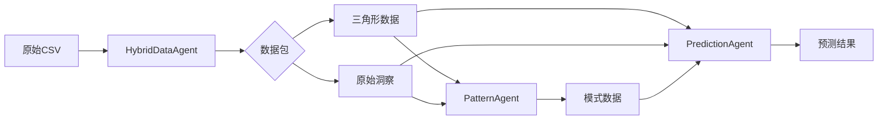

# 交通预测系统 - 数据规范文档

## 📊 数据流程概览

```
原始Excel数据 → CSV处理 → 三角形生成 → 聚类分析 → 预测生成
```

## 1. 输入数据格式

### 1.1 原始CSV数据结构
每行代表一次拥堵事件，包含以下字段：

| 字段名 | 类型 | 说明 | 示例 |
|--------|------|------|------|
| date | date | 日期 | 2014-01-02 |
| 上下 | string | 方向（上行/下行） | 上 |
| 原因 | string | 拥堵原因 | 交通集中 |
| 道路番号 | string | 道路名称 | 東北道 |
| 発生時刻 | time | 拥堵开始时间 | 10:55:00 |
| ピーク時刻 | time | 拥堵峰值时间 | 11:55:00 |
| ピーク長 | float | 峰值时拥堵长度(km) | 6.5 |
| 発生Ｋｐ | float | 拥堵起始位置(km) | 33.4 |
| 発生時渋滞長 | float | 初始拥堵长度(km) | 1.9 |
| 渋滞時間 | int | 总拥堵时间(分钟) | 280 |

### 1.2 文件命名规则
```
{道路名}_{方向}_{年份}_{月份}-{日期}.csv
例：東北道_上_2014_01-02.csv
```

## 2. 三角形数据结构

### 2.1 三角形的几何意义
```
        △ (apex: 峰值时刻和中心位置)
       /│\
      / │ \
     /  │  \
    /   │   \
   /____|____\
  (起点KP) (终点KP)
  base_start base_end
```

- **横轴(X)**：位置（KP，公里桩号）
- **纵轴(Y)**：时间（分钟，从0:00开始计算）
- **三角形面积**：表示拥堵的严重程度

### 2.2 三角形数据格式
```python
triangle = {
    'id': int,                          # 唯一标识
    'vertices': [(x1,y1), (x2,y2), (x3,y3)],  # 三个顶点坐标
    'center': (center_x, center_y),     # 中心点
    'area': float,                      # 面积
    'kp_start': float,                  # 起始KP
    'kp_end': float,                    # 结束KP
    'time_start': int,                  # 开始时间(分钟)
    'time_peak': int,                   # 峰值时间(分钟)
    'duration': int,                    # 持续时间
    'severity': float,                  # 严重程度(0-1)
    'direction': str,                   # 方向(上/下)
    'road_type': str,                   # 道路类型
    'source_file': str,                 # 来源文件
    'raw_data': dict                    # 原始数据行
}
```

## 3. 多Agent系统数据接口

### 3.1 Agent输入输出规范

#### **协调器Agent (Orchestrator)**
```python
# 输入
{
    'user_request': str,           # 用户原始请求
    'target_date': str,            # 预测目标日期
    'target_road': str,            # 目标道路
    'direction': str               # 方向(可选)
}

# 输出
{
    'prediction': dict,            # 最终预测结果
    'confidence': float,           # 置信度
    'report': str,                 # 分析报告
    'workflow_log': list           # 执行日志
}
```

#### **混合数据Agent (HybridDataAgent)**
```python
# 输入
{
    'file_paths': List[str],       # CSV文件路径列表
    'analysis_type': str           # 分析类型
}

# 输出
{
    'triangles': List[dict],       # 三角形数据
    'raw_insights': dict,          # 原始数据洞察
    'statistics': dict,            # 统计信息
    'anomalies': list             # 异常情况
}
```

#### **模式识别Agent (PatternRecognitionAgent)**
```python
# 输入
{
    'triangles': List[dict],       # 三角形列表
    'raw_insights': dict           # 原始数据洞察
}

# 输出
{
    'clusters': List[List[int]],   # 聚类结果
    'overlaps': List[dict],        # 重叠区域
    'patterns': List[dict],        # 识别的模式
    'confidence': float            # 模式置信度
}
```

#### **预测专家Agent (PredictionExpertAgent)**
```python
# 输入
{
    'triangles': List[dict],       # 历史三角形
    'patterns': dict,              # 识别的模式
    'raw_context': dict            # 原始数据上下文
}

# 输出
{
    'predicted_triangles': List[dict],  # 预测的三角形
    'prediction_details': {
        'date': str,
        'time_range': str,         # "17:00-19:30"
        'location_range': str,      # "KP20-35"
        'peak_time': str,          # "18:15"
        'peak_location': float,     # 27.5
        'severity': str,           # "high/medium/low"
        'duration': int,           # 分钟
        'affected_distance': float  # 公里
    },
    'explanation': str,            # 预测理由
    'confidence': float            # 置信度
}
```

### 3.2 数据传递流程



## 4. 关键算法参数

### 4.1 三角形生成参数
```python
TRIANGLE_CONFIG = {
    'min_duration': 10,           # 最小持续时间(分钟)
    'min_length': 0.5,            # 最小拥堵长度(km)
    'time_resolution': 5,         # 时间分辨率(分钟)
    'merge_threshold': 0.8        # 合并阈值
}
```

### 4.2 聚类参数
```python
CLUSTERING_CONFIG = {
    'algorithm': 'DBSCAN',
    'eps': 1.5,                   # 邻域半径
    'min_samples': 2,             # 最小样本数
    'metric': 'custom',           # 距离度量
    'weights': {
        'spatial': 1.0,           # 空间权重
        'temporal': 0.1,          # 时间权重
        'shape': 0.5              # 形状权重
    }
}
```

## 5. 输出格式规范

### 5.1 预测结果CSV格式
```csv
prediction_id,date,direction,start_time,peak_time,end_time,start_kp,peak_kp,end_kp,severity,confidence
1,2024-05-15,上,17:00,18:15,19:30,20.0,27.5,35.0,high,0.82
```

### 5.2 可视化输出
- **文件格式**: PNG
- **分辨率**: 1920x1080
- **内容**:
  - 底层：历史三角形（半透明蓝色）
  - 中层：聚类外包三角形（彩色边框）
  - 顶层：预测三角形（红色高亮）
  - 标注：时间轴、KP轴、图例

### 5.3 报告输出格式
```markdown
# 交通拥堵预测报告

## 预测摘要
- 日期：2024-05-15
- 路段：東北道（上行）
- 预测拥堵时段：17:00-19:30
- 预测拥堵位置：KP20-35
- 严重程度：高
- 置信度：82%

## 详细分析
[基于历史模式的分析内容]

## 建议措施
[交通管理建议]
```

## 6. 数据质量要求

### 6.1 完整性要求
- 必须字段不能为空
- 时间字段必须有效
- 位置字段必须在合理范围内

### 6.2 一致性要求
- 峰值时间 ≥ 开始时间
- 峰值拥堵长度 ≥ 初始拥堵长度
- 方向必须是"上"或"下"

### 6.3 异常数据处理
```python
# 异常数据标记
anomaly_flags = {
    'duration_too_long': duration > 600,      # 超过10小时
    'length_too_long': length > 50,           # 超过50km
    'speed_abnormal': speed < 0 or speed > 200,
    'missing_peak': peak_time is None
}
```

## 7. 性能指标

| 指标 | 目标值 | 说明 |
|------|--------|------|
| 数据加载时间 | <2秒 | 单个CSV文件 |
| 三角形生成 | <1秒/1000条 | 批量处理 |
| 聚类分析 | <5秒 | 1000个三角形 |
| 预测生成 | <10秒 | 完整流程 |
| 内存占用 | <2GB | 处理3年数据 |

---

**版本**: 1.0
**更新日期**: 2024-11-15
**维护者**: Multi-Agent Traffic Prediction System Team