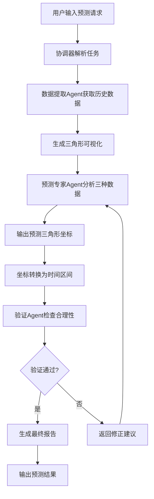

# 多Agent交通拥堵预测系统设计文档 V2.0

## 📌 项目概述

### 背景与动机
本项目旨在构建一个**模拟人类专家工作流程**的多Agent系统，通过LLM的推理能力来复现人类专家基于三角形可视化进行交通拥堵预测的决策过程。系统的核心思想是将历史拥堵数据抽象为三角形模式，通过识别重叠区域来预测未来的拥堵情况。

### 核心理念
- **三角形抽象**：将拥堵在时空维度上可视化为三角形，便于模式识别
- **重叠分析**：通过3年历史数据中的重叠三角形来预测今年的拥堵模式
- **LLM推理**：利用LLM的视觉理解和推理能力，无需复杂算法即可完成预测
- **人机协作**：数据预处理由人工完成，LLM专注于模式识别和预测

### 项目目标
1. 构建精简高效的Agent系统，专注于核心预测任务
2. 充分利用LLM的视觉理解和推理能力
3. 提供可解释的预测结果
4. 模拟人类专家基于视觉模式的判断过程

---

## 🏗️ 系统架构设计

### 整体架构图

```
┌─────────────────────────────────────────────────────────────┐
│                         用户接口层                           │
│                    (预测请求输入/结果输出)                    │
└─────────────────────────┬───────────────────────────────────┘
                          │
┌─────────────────────────▼───────────────────────────────────┐
│                    协调器 Agent                              │
│                  (Orchestrator)                             │
│         负责：任务理解、流程控制、结果汇总                    │
└──────┬──────────────┬──────────────┬────────────────────────┘
       │              │              │
┌──────▼────────┐ ┌──▼──────────┐ ┌▼──────────┐
│  数据提取      │ │   预测专家   │ │   验证     │
│   Agent       │ │    Agent     │ │   Agent    │
│               │ │              │ │            │
└───────┬───────┘ └──────┬───────┘ └─────┬──────┘
        │                │               │
┌───────▼────────────────▼───────────────▼──────┐
│              共享数据与上下文                   │
│     (原始数据、三角形图像、坐标信息)           │
└────────────────────────────────────────────────┘
        │                                │
┌───────▼──────────┐         ┌──────────▼──────┐
│   数据存储层      │         │   LLM 接口层    │
│ (已处理的CSV文件) │         │  (GPT-4V/Claude)│
└─────────────────┘         └─────────────────┘
```

### 核心组件说明

#### 1. **协调器 Agent (Orchestrator)**
- **角色定位**：总指挥，负责整体流程控制
- **核心职责**：
  - 接收预测请求（路段、日期、时间范围）
  - 协调各Agent的执行顺序
  - 管理数据在Agent间的传递
  - 汇总最终预测结果
  - 生成结构化输出报告

#### 2. **数据提取 Agent (Data Extraction Agent)**
- **角色定位**：数据分析师
- **核心职责**：
  - 根据指定条件提取历史数据（从已处理的CSV文件）
  - 识别相关的历史拥堵事件
  - 计算基础统计指标
  - 准备数据供预测Agent使用
  - 生成数据质量报告

#### 3. **预测专家 Agent (Prediction Expert)**
- **角色定位**：交通预测专家
- **核心职责**：
  - **输入三种数据**：
    1. 原始CSV数据（历史拥堵记录）
    2. 三角形可视化图像
    3. 三角形坐标数据
  - **基于LLM视觉理解能力**：
    - 识别历史三角形的重叠区域
    - 判断拥堵模式的相似性
    - 预测新的三角形位置和大小
  - **输出预测三角形坐标**：
    - 顶点位置（时间、里程）
    - 底边范围
    - 预测置信度
  - **提供预测理由说明**

#### 4. **验证 Agent (Validation Agent)**
- **角色定位**：质量控制专家
- **核心职责**：
  - 对比预测结果与历史数据的合理性
  - 检查预测三角形的物理约束
  - 评估时空连续性
  - 计算最终置信度分数
  - 生成验证报告和改进建议

---

## 🔄 工作流程设计

### 主流程



### 详细步骤说明

#### **Phase 1: 任务接收与解析**
```
用户输入 → 协调器Agent
- 解析预测需求（路段、日期、方向）
- 确定需要的历史数据范围（3年同期数据）
- 制定执行计划
```

#### **Phase 2: 数据提取与准备**
```
协调器 → 数据提取Agent
- 从预处理的CSV文件中提取相关数据
- 筛选同路段、同时期的历史记录
- 提取关键特征（発生時刻、ピーク時刻、渋滞長等）
- 准备三种格式的数据：
  1. 原始CSV数据表
  2. 待生成的三角形可视化需求
  3. 历史三角形坐标列表
```

#### **Phase 3: 三角形可视化生成**
```
数据 → 可视化工具（非LLM）
- 将时空数据转换为三角形图像
- X轴：时间维度
- Y轴：距离（KP）维度
- 三角形表示拥堵的时空范围
```

#### **Phase 4: LLM预测分析**
```
三种数据 → 预测专家Agent
输入：
1. 原始CSV数据（理解数值特征）
2. 三角形可视化图像（视觉模式识别）
3. 三角形坐标数据（精确位置信息）

处理：
- LLM分析重叠区域和模式
- 识别历史相似情况
- 推理预测三角形位置
- 无需DBSCAN等复杂算法

输出：
- 预测三角形的顶点坐标
- 底边起止点坐标
- 预测理由和置信度
```

#### **Phase 5: 坐标转换**
```
预测坐标 → 转换工具（非LLM）
- 将三角形坐标转换为：
  - 拥堵开始时间
  - 拥堵结束时间
  - 影响路段范围（KP起止）
  - 最大拥堵长度
```

#### **Phase 6: 验证与输出**
```
预测结果 → 验证Agent
- 检查预测的物理合理性
- 对比历史数据验证
- 评估预测质量
- 生成最终报告
```

---

## 💬 Agent间通信机制

### 数据流设计

```python
@dataclass
class PredictionRequest:
    """预测请求"""
    road_name: str        # 道路名称
    direction: str        # 方向（上/下）
    target_date: date     # 预测日期
    time_range: TimeRange # 时间范围

@dataclass
class TriangleData:
    """三角形数据结构"""
    apex_time: datetime      # 顶点时间
    apex_kp: float          # 顶点位置（KP）
    base_start_time: datetime # 底边起始时间
    base_end_time: datetime   # 底边结束时间
    base_kp: float          # 底边位置
    confidence: float       # 置信度

@dataclass
class PredictionPackage:
    """预测数据包"""
    raw_data: pd.DataFrame      # 原始CSV数据
    visualization: Image        # 三角形可视化图像
    triangle_coords: List[TriangleData] # 三角形坐标
    historical_patterns: Dict    # 历史模式统计
```

### 通信流程

1. **协调器 → 数据提取Agent**
   - 发送：PredictionRequest
   - 接收：提取的历史数据

2. **数据提取Agent → 预测专家Agent**
   - 发送：PredictionPackage（包含三种数据）

3. **预测专家Agent → 验证Agent**
   - 发送：预测的TriangleData
   - 发送：预测理由说明

4. **验证Agent → 协调器**
   - 发送：验证结果
   - 发送：最终预测报告

---

## 🧠 LLM集成策略

### LLM使用重点

#### 预测专家Agent的LLM应用
```python
def predict_with_llm(self, data_package: PredictionPackage) -> TriangleData:
    prompt = f"""
    你是一位交通拥堵预测专家。请基于以下三种数据进行预测：

    1. 历史拥堵数据（CSV）：
    {data_package.raw_data.to_string()}

    2. 三角形可视化图像：
    [图像已加载]

    3. 历史三角形坐标：
    {format_triangles(data_package.triangle_coords)}

    任务：
    - 观察图像中的三角形重叠模式
    - 识别过去3年同期的相似拥堵情况
    - 基于重叠区域预测今年的拥堵三角形

    请输出：
    1. 预测三角形的顶点坐标（时间、KP）
    2. 预测三角形的底边坐标
    3. 预测理由（基于哪些历史模式）
    4. 置信度（0-1）
    """
    return llm_with_vision.invoke(prompt, image=data_package.visualization)
```

### LLM vs 传统处理

| 任务 | LLM负责 | 传统方法负责 |
|------|---------|------------|
| 数据预处理 | - | 全部（CSV文件准备） |
| 数据提取 | 理解查询意图 | 文件读取和筛选 |
| 模式识别 | 视觉理解、重叠识别 | - |
| 预测生成 | 全部（基于推理） | - |
| 坐标转换 | - | 数学计算 |
| 验证 | 逻辑判断 | 数值检查 |

---

## 📁 数据组织建议

### 推荐方案：按日期组织文件

**目录结构：**
```
data/processed_data/
├── 東北道_上_2014_02-21.csv
├── 東北道_上_2015_02-21.csv
├── 東北道_上_2016_02-21.csv
└── ...
```

**优势：**
- 便于按日期快速检索
- 支持跨年对比分析
- 文件大小适中，加载快速
- 符合人类专家的思维模式

**备选方案：统合文件**
- 如需要可以生成年度汇总文件
- 但建议保留日文件以支持灵活查询

---

## 🛠️ 技术实现

### 简化的实现架构

```python
class TrafficPredictionSystem:
    def __init__(self):
        self.orchestrator = OrchestratorAgent()
        self.data_extractor = DataExtractionAgent()
        self.predictor = PredictionExpertAgent()
        self.validator = ValidationAgent()

    def predict(self, request: PredictionRequest):
        # 1. 提取数据
        historical_data = self.data_extractor.extract(request)

        # 2. 生成可视化
        visualization = generate_triangle_viz(historical_data)

        # 3. LLM预测
        prediction = self.predictor.predict(
            raw_data=historical_data,
            image=visualization,
            coordinates=extract_coordinates(historical_data)
        )

        # 4. 验证
        validated = self.validator.validate(prediction, historical_data)

        # 5. 转换输出
        return convert_to_result(validated)
```

### 关键技术选择

1. **LLM选择**
   - 推荐：GPT-4V 或 Claude-3（支持视觉理解）
   - 需要：图像理解 + 强推理能力

2. **可视化工具**
   - Matplotlib/Plotly生成三角形图
   - 清晰的时空坐标系

3. **数据处理**
   - Pandas处理CSV
   - 简单的文件系统管理

---

## 📊 评估指标

### 系统指标

| 指标 | 说明 | 目标值 |
|------|------|--------|
| 预测准确率 | 预测与实际的匹配度 | >75% |
| 响应时间 | 完成预测的时间 | <20秒 |
| 推理质量 | LLM推理的合理性 | 高 |
| 可解释性 | 预测理由的清晰度 | 清晰 |

---

## 🚀 实施建议

### 开发优先级

1. **Phase 1：数据准备**（已完成）
   - ✅ CSV数据预处理
   - ✅ 按日期组织文件

2. **Phase 2：核心功能**
   - [ ] 数据提取Agent
   - [ ] 三角形可视化生成
   - [ ] 预测专家Agent（LLM集成）

3. **Phase 3：完善系统**
   - [ ] 验证Agent
   - [ ] 协调器完善
   - [ ] 结果输出格式化

4. **Phase 4：优化**
   - [ ] Prompt优化
   - [ ] 性能调优
   - [ ] 错误处理

---

## 📝 总结

本次设计优化聚焦于：

1. **精简架构**：去除冗余的模式识别Agent，保留核心的4个Agent
2. **明确分工**：人工处理数据预处理，LLM专注预测
3. **充分利用LLM**：通过视觉理解和推理能力直接完成预测，无需复杂算法
4. **三重输入**：原始数据+可视化+坐标，为LLM提供全面信息
5. **实用导向**：简化实现，快速验证效果

这种设计充分发挥了LLM的优势，同时避免了在数据预处理等非核心任务上的复杂性，更贴近实际应用需求。