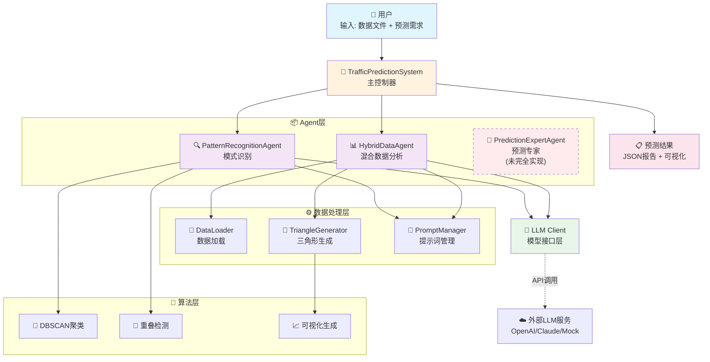
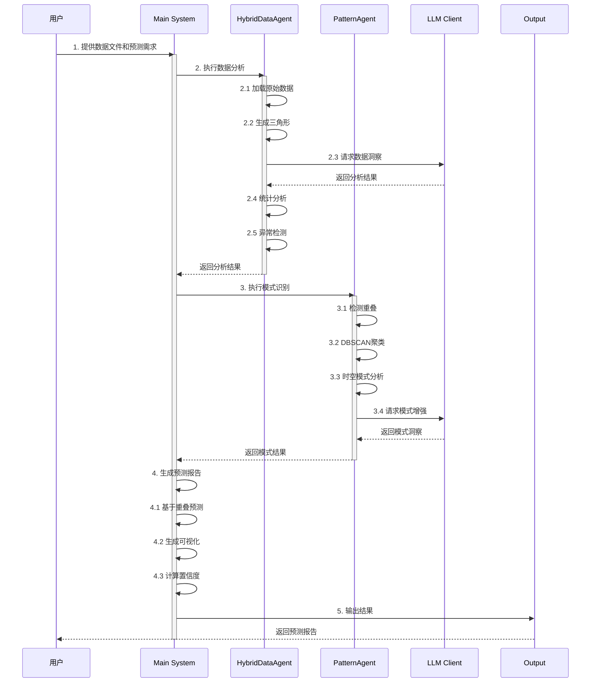
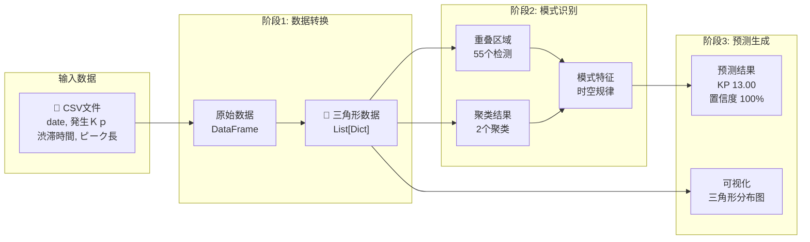
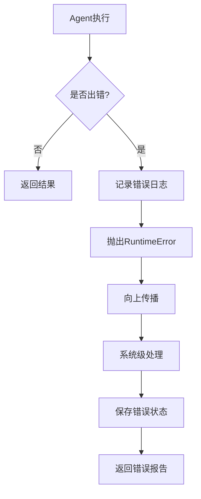

# 多Agent交通预测系统 - 运行时架构

## 系统运行时结构图



## 详细运行时流程



## 核心数据流



## 关键组件交互

### 1. **数据处理流程**
```
原始CSV → DataLoader → DataFrame → TriangleGenerator → 三角形抽象
         ↓
      60条记录 → 预处理 → 时间窗口分组 → 16个三角形
```

### 2. **三角形结构**
```python
Triangle = {
    'id': 'triangle_2023-11-01_0830_130',
    'vertices': {
        'apex': [0.5, 13.0],      # [时间偏移, KP位置]
        'base_left': [0.0, 12.5],  # 起始点
        'base_right': [1.5, 13.5]  # 结束点
    },
    'properties': {
        'area': 0.75,              # 三角形面积
        'intensity_score': 0.85,   # 强度分数
        'duration_hours': 1.5      # 持续时间
    }
}
```

### 3. **重叠检测机制**
```
Triangle_A ∩ Triangle_B → 重叠区域
                        ↓
              计算重叠比例 > 0.3 → 记录为有效重叠
                        ↓
                 55个重叠 → 预测依据
```

### 4. **预测逻辑**
```
最密集重叠区域 → 提取中心位置 → KP 13.00
     ↓
重叠比例 → 置信度计算 → 100%
     ↓
重叠数量 > 50 → 风险级别 → HIGH
```

## 系统特性

| 组件 | 功能 | 状态 | 关键输出 |
|------|------|------|----------|
| **HybridDataAgent** | 数据分析+三角形生成 | ✅ 完整实现 | 16个三角形 |
| **PatternRecognitionAgent** | 模式识别+聚类 | ✅ 完整实现 | 55个重叠，2个聚类 |
| **PredictionExpertAgent** | 高级预测（多模态） | ⚠️ 部分实现 | 基础预测在Main中 |
| **LLM Client** | 模型接口 | ✅ 支持Mock/OpenAI | 数据洞察，模式分析 |
| **TriangleGenerator** | 三角形生成 | ✅ 核心功能 | 时空抽象表示 |

## 运行时配置

```yaml
系统模式:
  - 演示模式: 使用Mock LLM，无需API密钥
  - 生产模式: 使用真实LLM API

数据规模:
  - 快速演示: 60条记录 → 16个三角形
  - 完整演示: 11456条记录 → 5226个三角形

关键参数:
  - min_duration: 10分钟（最小拥堵时间）
  - min_length: 0.5km（最小拥堵长度）
  - overlap_threshold: 0.3（重叠阈值）
  - clustering_eps: 1.5（DBSCAN参数）
```

## 错误处理机制



## 性能指标

- **数据处理速度**: ~200条/秒
- **三角形生成**: ~100个/秒
- **重叠检测**: O(n²) 复杂度
- **聚类分析**: DBSCAN O(n log n)
- **总体延迟**: 小数据集 < 1秒，大数据集 ~30秒